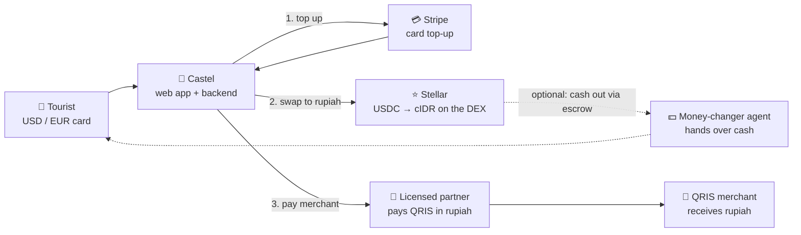
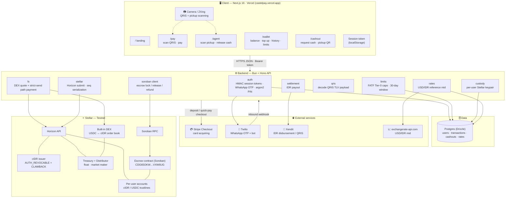
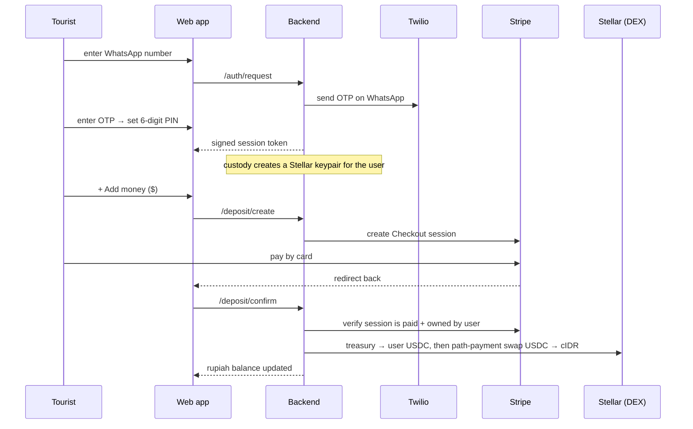
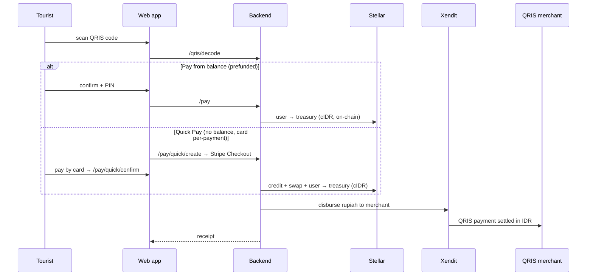
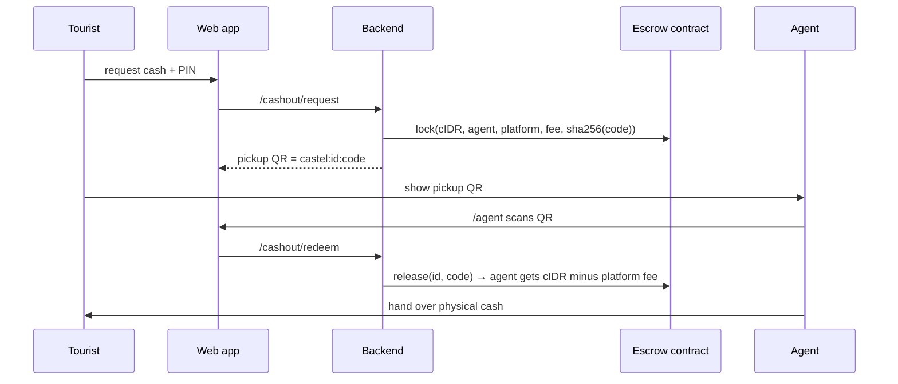

# Castel — Architecture

**Cash on Stellar.** A holiday wallet that lets USD/EUR tourists pay any Indonesian QRIS
merchant and withdraw rupiah cash — no local bank account, SIM, or ID. Card top-up becomes
USDC on Stellar, swaps to rupiah (`cIDR`) on Stellar's built-in DEX, and pays the merchant
in real rupiah through a licensed settlement partner.

This document has two views of the same system:

1. **[Simple view](#1-simple-view)** — the one-glance mental model.
2. **[Detailed view](#2-detailed-view)** — every component, service, and on-chain piece, plus the key flows.

> Diagrams are [Mermaid](https://mermaid.js.org) — they render natively on GitHub. Paste any
> block into [mermaid.live](https://mermaid.live) to export a PNG/SVG for a slide deck.

---

## 1. Simple view

The whole product is three moves: **fund → swap → pay** (with an optional **cash out**).

**In words:** the tourist logs in with their WhatsApp number, tops up by card, and their
balance appears in **rupiah**. When they scan a merchant's QRIS code, Castel swaps their
balance to rupiah on Stellar's DEX and pays the merchant through a licensed partner — the
merchant just receives a normal QRIS payment and never touches crypto. Any leftover balance
can be collected as physical cash from a partner money-changer, secured on-chain by a
Soroban escrow.

---

## 2. Detailed view

### 2.1 System architecture

### 2.2 Components at a glance

| Layer | Tech | Responsibility |
|---|---|---|
| **Frontend** | Next.js 16, React 19, Tailwind 4, ZXing | Camera scanning + card entry (the two things a chat can't do); rupiah-first UI; holds only a signed session token |
| **Backend** | Bun, Hono, Drizzle | Auth, custody, FX orchestration, limits, settlement, QRIS decode |
| **Database** | Postgres | `users` (wallet + hashed PIN/OTP), `transactions` (ledger + idempotency markers), `cashouts`, `rates` |
| **Smart contract** | Rust, soroban-sdk 26 | `escrow` — hashlocked cash-out custody (`lock` / `release` / `refund` / `get_escrow`) |
| **Card** | Stripe Checkout | Card acquiring for top-ups and Quick Pay |
| **Messaging** | Twilio WhatsApp | OTP delivery + inbound bot |
| **Settlement** | Xendit | Rupiah payout to the merchant (sandbox in demo) |
| **FX reference** | exchangerate-api.com | Live USD/IDR mid the DEX book is repriced around |
| **Chain** | Stellar testnet (Horizon + Soroban RPC) | Asset issuance, DEX path payments, escrow |

### 2.3 On-chain design

- **`cIDR`** — a rupiah unit of account issued on Stellar. The issuer account carries
  `AUTH_REVOCABLE` + `AUTH_CLAWBACK_ENABLED` so balances can be frozen/reversed for fraud or
  lawful order. SEP-1 `stellar.toml` is served at the live domain. Testnet only, no fiat backing.
- **FX = native DEX, not a contract.** `swapUsdcToCidr` quotes the live order book
  (`strictSendPaths`) and executes a `pathPaymentStrictSend` with a `destMin` slippage bound
  derived from that quote. A market-maker (distributor) account keeps a two-sided book priced
  around the live USD/IDR mid (30 bps spread), repriced off-chain by `refresh-market.ts`.
- **Escrow = Soroban, only where trust is needed.** Cash-out locks `cIDR` under a hashlock
  (`pickup_hash = sha256(code)`); the agent releases it by presenting the code. Checks-effects-
  interactions ordering, a refund timelock protecting the agent, TTL extension, and property/fuzz
  tests proving fund conservation + hashlock access control.

### 2.4 Key flows

**A · Onboarding + top-up (card → rupiah balance)**

**B · Pay a merchant** — two ways, same on-chain settlement

**C · Cash out (Soroban escrow)**

### 2.5 Security posture (summary)

- Identity is always derived from a **server-signed HMAC token**, never a client-supplied field.
- **PIN** (argon2) authorises every spend and never travels over WhatsApp; OTP + PIN both hashed,
  both attempt-limited, all secret comparisons timing-safe.
- Card flows (`/deposit/confirm`, `/pay/quick/confirm`) are **idempotent** (per-leg DB markers) and
  verified server-side against Stripe.
- **Known limitations (honest):** user Stellar secret keys are stored unencrypted for the testnet
  demo (production → KMS/envelope encryption); merchant settlement runs on Xendit sandbox; escrow
  `release()` lacks an on-chain `require_auth` (gated by the pickup code in the backend today). See
  `castel-sc/AUDIT.md`.

---

## Repositories

| Repo | What |
|---|---|
| `castel-fe` | Next.js web app (this deploys to castelpay.vercel.app) |
| `castel-be` | Bun + Hono backend, Stellar/Stripe/Twilio/Xendit integration |
| `castel-sc` | Soroban `escrow` contract (Rust) — deployed `CDG65OKW…VXW6UG` |
