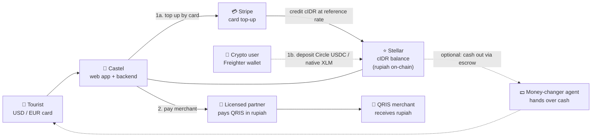
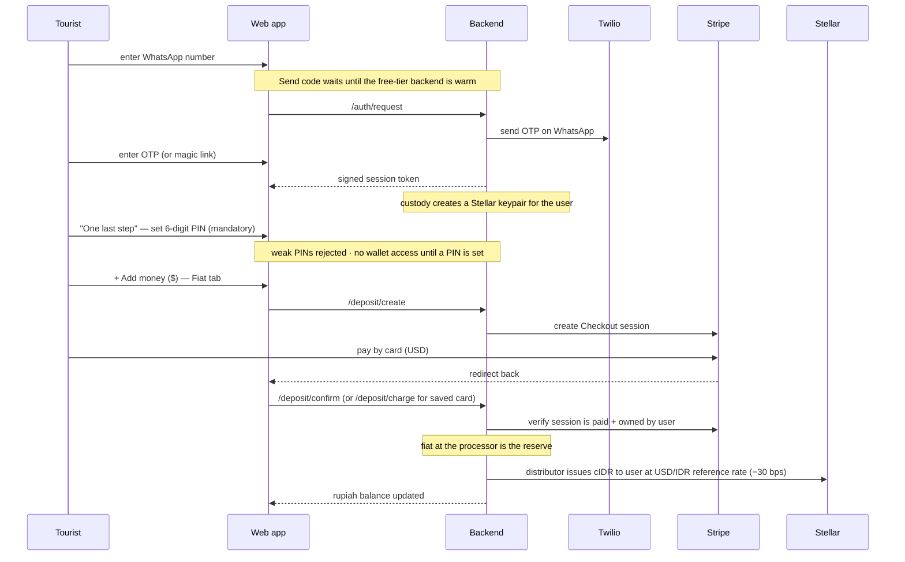
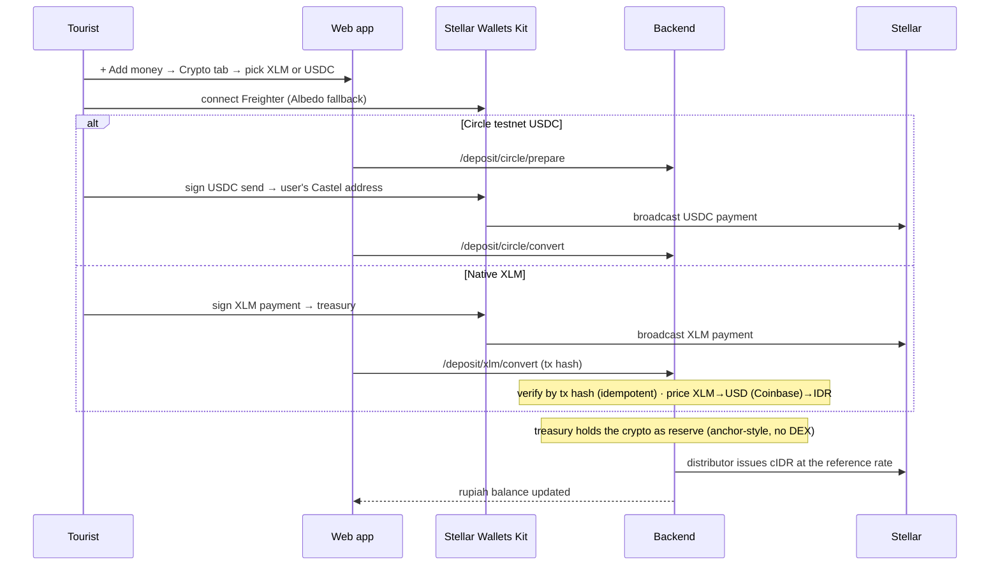
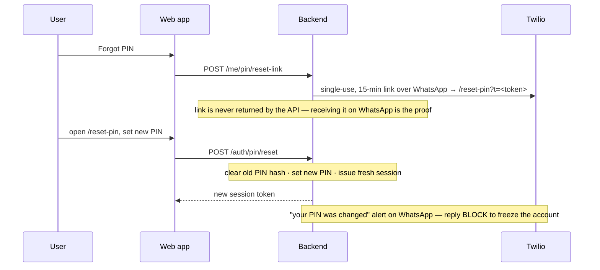
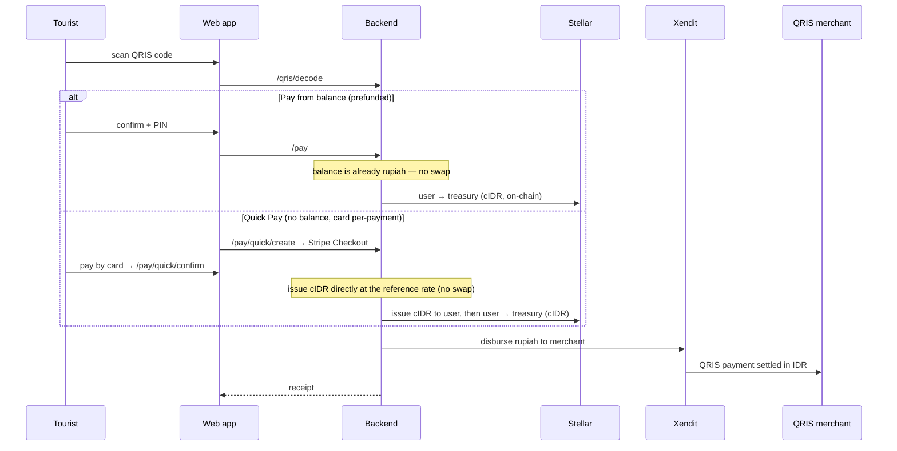
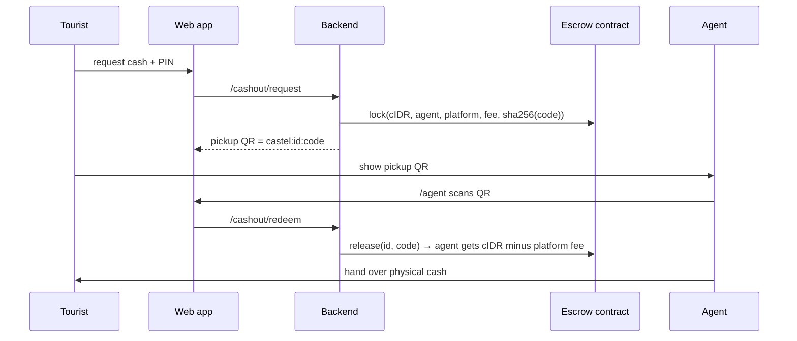

# Castel — Architecture

**Cash on Stellar.** A holiday wallet that lets USD/EUR tourists pay any Indonesian QRIS
merchant and withdraw rupiah cash — no local bank account, SIM, or ID. A card top-up is
credited straight to the user as rupiah (`cIDR`) at the live USD/IDR reference rate — the
fiat held at the processor is the reserve. Crypto-native users can instead connect a Stellar
wallet and deposit real Circle USDC or native XLM, taken as reserve at the same reference
rate. Either way the merchant is paid in real rupiah through a licensed settlement partner,
and Stellar's built-in DEX powers the optional `USDC → cIDR` exchange.

This document has two views of the same system:

1. **[Simple view](#1-simple-view)** — the one-glance mental model.
2. **[Detailed view](#2-detailed-view)** — every component, service, and on-chain piece, plus the key flows.

> Diagrams are [Mermaid](https://mermaid.js.org) — they render natively on GitHub. Paste any
> block into [mermaid.live](https://mermaid.live) to export a PNG/SVG for a slide deck.

---

## 1. Simple view

The whole product is three moves: **fund → pay → (optionally) cash out**. The balance is
rupiah (`cIDR`) the moment it's funded — no swap sits between funding and paying.

**In words:** the tourist logs in with their WhatsApp number and tops up by card — the card
is charged in USD and Castel credits the balance directly in **rupiah** at the live reference
rate, so the balance is rupiah from the start. Crypto-native users can instead connect a
Stellar wallet and deposit real Circle USDC or native XLM, which the treasury takes as reserve
to issue the same rupiah balance. When they scan a merchant's QRIS code, Castel transfers that
rupiah balance on-chain and pays the merchant through a licensed partner — no swap is needed,
because the balance is already rupiah, and the merchant just receives a normal QRIS payment
and never touches crypto. Any leftover balance can be collected as physical cash from a
partner money-changer, secured on-chain by a Soroban escrow.

---

## 2. Detailed view

### 2.1 System architecture

```mermaid
flowchart TB
    subgraph client["🖥️ Client — Next.js 16 · Vercel (castelpay.vercel.app)"]
        direction TB
        LAND["/ landing"]
        WALLET["/wallet<br/>balance · top up · history · limits"]
        PAY["/pay<br/>scan QRIS · pay"]
        CASHOUT["/cashout<br/>request cash · pickup QR"]
        AGENTPG["/agent<br/>scan pickup · release cash"]
        RESETPG["/reset-pin<br/>redeem WhatsApp reset link · set new PIN"]
        CAM["📷 Camera / ZXing<br/>QRIS + pickup scanning"]
        WKIT["🦊 Stellar Wallets Kit<br/>Freighter · Albedo — crypto tab · connection persisted"]
        SESS["Session token<br/>(localStorage)"]
    end

    subgraph backend["⚙️ Backend — Bun + Hono API"]
        direction TB
        AUTH["auth<br/>HMAC session tokens · WhatsApp OTP<br/>mandatory argon2 PIN · WhatsApp PIN-reset · freeze"]
        LIMITS["limits<br/>FATF Tier-0 caps · 30-day window"]
        CUSTODY["custody<br/>per-user Stellar keypair"]
        DEPOSIT["deposit<br/>card → cIDR at reference rate · Circle USDC · native XLM"]
        FX["fx<br/>reference-rate quote · live XLM→rupiah quote · optional USDC→cIDR path payment"]
        SOROBANL["soroban client<br/>escrow lock / release / refund"]
        QRIS["qris<br/>decode QRIS TLV payload"]
        SETTLE["settlement<br/>IDR payout"]
        RATES["rates<br/>USD/IDR reference mid"]
        STELLARL["stellar<br/>Horizon submit · seq serialization"]
    end

    subgraph data["🗄️ Data"]
        PG[("Postgres (Drizzle)<br/>users · transactions · cashouts · rates")]
    end

    subgraph ext["🌐 External services"]
        STRIPE["💳 Stripe Checkout<br/>card acquiring"]
        TWILIO["💬 Twilio<br/>WhatsApp OTP + bot"]
        XENDIT["🏦 Xendit<br/>IDR disbursement / QRIS"]
        ERAPI["📈 exchangerate-api.com<br/>USD/IDR mid"]
        COINBASE["📈 Coinbase<br/>XLM/USD spot"]
    end

    subgraph chain["⭐ Stellar — Testnet"]
        direction TB
        HORIZON["Horizon API"]
        SRPC["Soroban RPC"]
        DEX["Built-in DEX<br/>USDC ↔ cIDR order book<br/>(optional exchange path only)"]
        ISSUER["cIDR issuer<br/>AUTH_REVOCABLE + CLAWBACK"]
        TREASURY["Treasury + Distributor<br/>reserve · issues cIDR at reference rate · market maker"]
        USERACC["Per-user accounts<br/>cIDR / USDC trustlines"]
        ESCROW["Escrow contract (Soroban)<br/>CDG65OKW…VXW6UG"]
    end

    client -->|HTTPS JSON · Bearer token| backend
    CAM -.-> PAY
    CAM -.-> AGENTPG
    WKIT -.->|sign & broadcast Circle USDC / native XLM deposit| chain

    AUTH --> TWILIO
    AUTH --> PG
    LIMITS --> PG
    CUSTODY --> PG
    SETTLE --> XENDIT
    RATES --> ERAPI
    RATES --> PG
    backend -->|deposit / quick-pay checkout| STRIPE
    DEPOSIT -->|XLM/USD spot| COINBASE
    TWILIO -->|inbound webhook| backend

    DEPOSIT --> STELLARL
    DEPOSIT --> RATES
    FX --> HORIZON
    FX --> DEX
    FX --> COINBASE
    STELLARL --> HORIZON
    SOROBANL --> SRPC --> ESCROW
    HORIZON --- ISSUER
    HORIZON --- TREASURY
    HORIZON --- USERACC
    DEX --- TREASURY
    ESCROW --- USERACC
```

### 2.2 Components at a glance

| Layer | Tech | Responsibility |
|---|---|---|
| **Frontend** | Next.js 16, React 19, Tailwind 4, ZXing | Camera scanning + card entry (the two things a chat can't do); rupiah-first UI with deposit result cards; the mandatory set-PIN and `/reset-pin` screens; persisted wallet connection; holds only a signed session token |
| **Backend** | Bun, Hono, Drizzle | Auth (mandatory PIN, WhatsApp PIN-reset, account freeze), custody, FX orchestration, limits, settlement, QRIS decode |
| **Database** | Postgres | `users` (wallet + hashed PIN/OTP + `frozen` flag), `transactions` (ledger + idempotency markers), `cashouts`, `rates` |
| **Smart contract** | Rust, soroban-sdk 26 | `escrow` — hashlocked cash-out custody (`lock` / `release` / `refund` / `get_escrow`) |
| **Card** | Stripe Checkout | Card acquiring for top-ups and Quick Pay; the charge is credited straight to the user as `cIDR` at the reference rate (fiat at the processor is the reserve) |
| **Crypto on-ramp** | Stellar Wallets Kit (Freighter · Albedo) | Connect a wallet and deposit real Circle testnet USDC or native XLM, taken as reserve to issue `cIDR` (anchor-style, no DEX) |
| **Messaging** | Twilio WhatsApp | OTP delivery + inbound bot |
| **Settlement** | Xendit | Rupiah payout to the merchant (sandbox in demo) |
| **FX reference** | exchangerate-api.com · Coinbase | Live USD/IDR mid the card/crypto rails credit at and the DEX book is repriced around; Coinbase XLM/USD spot prices XLM deposits |
| **Chain** | Stellar testnet (Horizon + Soroban RPC) | Asset issuance, optional DEX path payments, escrow |

### 2.3 On-chain design

- **`cIDR`** — a rupiah unit of account issued on Stellar. The issuer account carries
  `AUTH_REVOCABLE` + `AUTH_CLAWBACK_ENABLED` so balances can be frozen/reversed for fraud or
  lawful order. SEP-1 `stellar.toml` is served at the live domain. Testnet only, no fiat backing.
- **Funding rails issue cIDR directly at the reference rate.** The card, Quick Pay, native XLM
  and Circle-USDC rails are all DEX-free: the processor or the treasury takes the incoming
  value as reserve and the distributor issues `cIDR` at the live USD/IDR reference rate (card
  charges carry a 30 bps spread; `creditUsdAsRupiah`). XLM deposits are verified by tx hash
  (idempotent) and priced XLM→USD (Coinbase spot)→IDR; Circle USDC is a real testnet asset
  (issuer `GBBD47IF…FLA5`) sent from the user's own wallet.
- **The native DEX powers only the optional USDC→rupiah exchange.** `swapUsdcToCidr`
  (`quoteUsdcToCidr`) quotes the live order book (`strictSendPaths`) and executes a
  `pathPaymentStrictSend` with a `destMin` slippage bound derived from that quote. A
  market-maker (distributor) account keeps a two-sided book priced around the live USD/IDR mid
  (30 bps spread), repriced off-chain by `refresh-market.ts`. `/fx/quote` is a reference-rate
  preview, and `/fx/xlm-quote` powers a live rupiah preview for native-XLM deposits (XLM→USD via
  Coinbase→cIDR at the reference rate).
- **Escrow = Soroban, only where trust is needed.** Cash-out locks `cIDR` under a hashlock
  (`pickup_hash = sha256(code)`); the agent releases it by presenting the code. Checks-effects-
  interactions ordering, a refund timelock protecting the agent, TTL extension, and property/fuzz
  tests proving fund conservation + hashlock access control.

### 2.4 Key flows

**A · Onboarding + top-up (card → rupiah balance)**

**A2 · Connect a wallet — crypto on-ramp (Circle USDC / native XLM)**

**A3 · Forgot PIN → single-use WhatsApp reset link**

**B · Pay a merchant** — two ways, same on-chain settlement

**C · Cash out (Soroban escrow)**

### 2.5 Security posture (summary)

- Identity is always derived from a **server-signed HMAC token**, never a client-supplied field.
- **A 6-digit PIN is mandatory onboarding** — after the first sign-in (OTP or magic link) a new user
  must set one on a required "One last step" screen before the wallet unlocks; weak PINs (sequential
  runs like `123456`, repeats like `111111`) are rejected. The **PIN** (argon2) authorises every spend
  and never travels over WhatsApp; OTP + PIN both hashed, both attempt-limited, all secret comparisons
  timing-safe. A PIN locks after 5 failures and routes to the forgot-PIN reset.
- **Forgot PIN → single-use WhatsApp reset link.** `/me/pin/reset-link` sends a single-use, 15-minute
  link over WhatsApp (never returned by the API — receiving it is the proof) to the `/reset-pin` web
  page; redeeming it (`/auth/pin/reset`) clears the old PIN hash, sets the new one, and issues a fresh
  session.
- **Account freeze.** The owner freezes the account (`users.frozen`) by replying **BLOCK** to the
  "your PIN was changed" WhatsApp alert; all spends are blocked while frozen.
- Card flows (`/deposit/confirm`, `/pay/quick/confirm`) are **idempotent** (per-leg DB markers) and
  verified server-side against Stripe.
- **Known limitations (honest):** user Stellar secret keys are stored unencrypted for the testnet
  demo (production → KMS/envelope encryption); merchant settlement runs on Xendit sandbox; escrow
  `release()` lacks an on-chain `require_auth` (gated by the pickup code in the backend today). See
  `castel-sc/AUDIT.md`.

---

## Repositories

| Repo | What |
|---|---|
| `castel-fe` | Next.js web app (this deploys to castelpay.vercel.app) |
| `castel-be` | Bun + Hono backend, Stellar/Stripe/Twilio/Xendit integration |
| `castel-sc` | Soroban `escrow` contract (Rust) — deployed `CDG65OKW…VXW6UG` |
