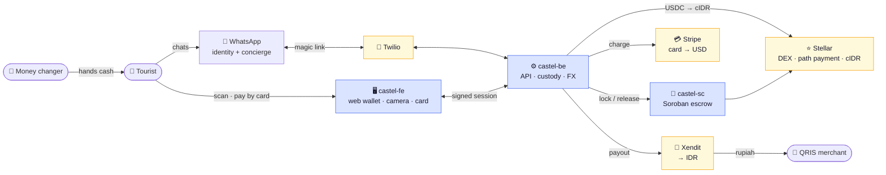

# Castel — Cash on Stellar

**A holiday wallet for the tourists Indonesia's payment system leaves out.**

Load it with a card. Pay any QRIS merchant in Bali. Take the rest home as cash.
No Indonesian bank account, no SIM card, no KTP. It runs on WhatsApp.

🔗 **Live:** [castelpay.vercel.app](https://castelpay.vercel.app) · API [castel-be.onrender.com](https://castel-be.onrender.com)

---

## The problem

Bank Indonesia built **QRIS** to bring micro-merchants into digital payments — 45 million
of them, 93% MSMEs. It worked. But a tourist arriving from Australia, with an Australian
phone and card, has no practical way to pay that warung. Indonesia's wallets (GoPay, OVO,
DANA) each need a +62 SIM, an Indonesian debit card, a bank account and a KTP — four things
a tourist has none of.

BI's own **QRIS Cross-Border** covers six Asian countries. **Australia — Bali's #1 source
market at 23% — is not one of them.** Castel is for the visitors left outside.

---

## How it fits together

WhatsApp is the account. The web app is just a camera and a card form — the two things a
chat can't do. The backend holds the keys and moves the money. Stellar is the FX rail. The
merchant and the money changer always touch **rupiah**, never crypto.

---

## Repositories

| Repo | What it is | Stack |
|---|---|---|
| **[castel-fe](https://github.com/CastelPay/castel-fe)** | Web wallet — camera scan, card top-up, PIN | Next.js 16 · Tailwind 4 · Bun |
| **[castel-be](https://github.com/CastelPay/castel-be)** | API, custody, FX, settlement, auth | Hono · Bun · Postgres · stellar-sdk |
| **[castel-sc](https://github.com/CastelPay/castel-sc)** | Cash-out escrow contract | Rust · soroban-sdk |

Full architecture (simple + detailed diagrams): **[ARCHITECTURE.md](https://github.com/CastelPay/castel-be/blob/main/ARCHITECTURE.md)**

---

## Why Stellar

- **Path payments** — `USDC → cIDR` is one atomic operation across the protocol's built-in
  DEX. No AMM to deploy, priced against the live USD/IDR rate.
- **Native assets + compliance flags** — cIDR is a classic Stellar asset with
  `AUTH_REVOCABLE` and clawback, the same issuance pattern as USDC, PYUSD and MoneyGram's
  MGUSD. No token contract needed.
- **Soroban** — used only where custom on-chain logic is warranted: a hashlocked escrow for
  trustless cash-out at partner money changers.

Merchants are always settled in Indonesian rupiah by a licensed payment provider — the
Stellar asset is never presented as a means of payment.

---

*Built for the APAC Stellar Hackathon 2026 · Track: Local Finance & Real-World Access.*
